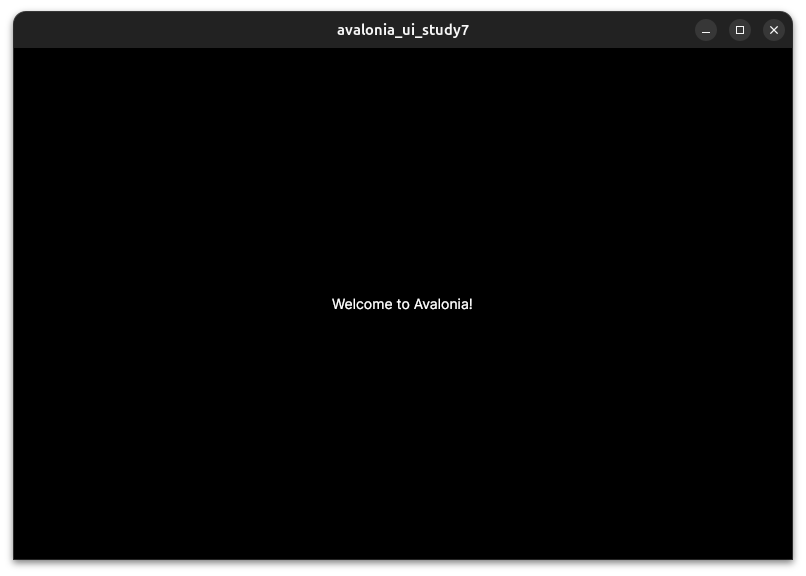
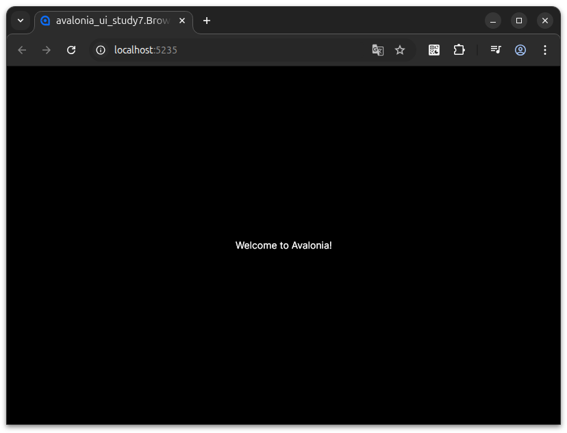

# avalonia_ui_study7

## 概要
* Avalonia UI をブラウザで実行する場合の構成の確認

## 詳細

```sh
dotnet new globaljson --sdk-version 8.0.400 --roll-forward latestFeature
# dotnet new gitignore ※avalonia.xplat が自動生成するためコメントアウト
dotnet workload install wasm-tools
dotnet new install avalonia.templates
dotnet new avalonia.xplat -f net8.0
```

```
dotnet run --project avalonia_ui_study7.Desktop
dotnet run --project avalonia_ui_study7.Browser
```



